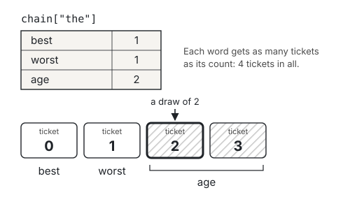

# Markov chains: a dictionary that writes like a book

Here are the first lines of *A Tale of Two Cities*, a novel by Charles
Dickens (1859), in small letters and without commas. The program prints
each word that comes straight after "the". Before you run it, which words
do you expect? Does any of them come twice?

```csharp exec
id: words-that-follow-words-1
string text = "it was the best of times it was the worst of times "
    + "it was the age of wisdom it was the age of foolishness";
string[] words = text.Split(' ');
for (int i = 0; i < words.Length - 1; i++)
{
    if (words[i] == "the")
    {
        Console.WriteLine($"the {words[i + 1]}");
    }
}
```

[[OPENER-RESULT]] The loop looks at every pair of neighbouring words: the
word at index `i`, and the word at index `i + 1`, straight after it. It
stops one word before the end, because the last word has no word after
it. Can you change `"the"` to `"of"`, and see which words follow "of"?

By the end of this page, a program that has read two chapters of a real
book writes sentences like this one, which nobody has written before:

> [[HOOK]]

This page is an extra, so you can do it whenever you have time. It needs
dictionaries, from [Dictionaries](lesson:looking-things-up-by-name), a
random number generator with a seed, from
[Random numbers](lesson:leaving-it-to-chance), and a class that keeps
methods together, from [Reusable methods](lesson:building-reusable-tools).
On this page we:

- count which words follow which, in a dictionary whose values are
  dictionaries
- choose each next word at random, so that a pair that is common in the
  text is chosen more often
- build a chain from two chapters of a book, and see why a grid would be
  far too big to hold it
- build a chain from a text that you choose

## Words that follow words

Suppose we write a new sentence, using only the pairs in Dickens's text.
Start on the word "it". In the text, "it" is always followed by "was", so
the next word is "was". "was" is always followed by "the". After "the"
there is a choice: "best", "worst" or "age". Say we choose "age". "age" is
always followed by "of", and after "of" there is a choice again. Say we
choose "times". We have written this:

> it was the age of times

That sentence is not in the text. But every pair of neighbouring words in
it is: "the age" is in the text, and so is "of times".

What we just did is a *Markov chain*: a process that moves, one step at a
time, from one *state* to the next. A state is one of the conditions that
the process can be in. Here, each state is a word. Which state comes next
depends only on the state it is in now, and not on the states before it.
To choose the next word, the chain looks only at the word it has just
written. It does not remember any word before that one.

The idea is named after Andrey Markov, a Russian mathematician. In 1913 he
used it to study the letters of a long Russian poem, *Eugene Onegin*: how
often a vowel followed a vowel, and how often a consonant did. Predictive
text on a phone uses the same idea, with far more text: from the word you
have just typed, which words are likely to come next?

To write like this, a program needs to know, for every word, which words
followed it in the text, and how many times each one did. The next section
keeps all of that in one dictionary.

## A dictionary of dictionaries

Take a shorter text: "the cat sat on the mat". "the" is followed once by
"cat" and once by "mat". "cat" is followed by "sat", "sat" by "on", and
"on" by "the". In C#, all of that can be one dictionary, whose keys are the
words. The value under each word is another dictionary: the words that
followed it, and how many times each one did. A dictionary whose values are
dictionaries is called a *dictionary of dictionaries*. Each dictionary
inside it is an *inner dictionary*.

```csharp exec
id: a-dictionary-of-dictionaries-1
Dictionary<string, Dictionary<string, int>> chain = new()
{
    ["the"] = new() { ["cat"] = 1, ["mat"] = 1 },
    ["cat"] = new() { ["sat"] = 1 },
    ["sat"] = new() { ["on"] = 1 },
    ["on"] = new() { ["the"] = 1 },
};
Console.WriteLine(chain["the"]["mat"]);
Console.WriteLine(chain["the"].Count);
Console.WriteLine(chain.Count);
```

```predict
type: choice

What will the last line print?

- 4
  - `chain.Count` counts the keys of the outer dictionary.
- 5
  - The text has five different words.
- 6
  - The text has six words.
```

The type `Dictionary<string, Dictionary<string, int>>` reads from the
outside in. It is a dictionary whose keys are of type `string`, and whose
values are each a `Dictionary<string, int>`. In each inner dictionary, a
key is a word that followed, and its value is how many times it followed.
`new()` inside the curly brackets makes each inner dictionary, with its
pairs in its own curly brackets.

`chain["the"]["mat"]` is two lookups, one after the other. `chain["the"]`
gives the inner dictionary for "the", and `["mat"]` finds the count in it:
[[CAT-1]]. It has the same shape as `palette['o'][1]` on
[Dictionaries](lesson:looking-things-up-by-name): first by key, and then
again. `chain["the"].Count` is [[CAT-2]]: two different words followed "the".

The last line is [[CAT-3]]. `chain.Count` counts the keys of the outer
dictionary, and "mat" is not one of them. Nothing came after "mat" in the
text, so it has no inner dictionary. That will matter when the chain
writes. If it ever reaches "mat", there is no word to choose, and it must
stop.

Typing a chain by hand is fine for six words. For a longer text, a loop
builds it. The loop takes each pair of neighbouring words, as the first
cell on this page did, and adds 1 to that pair's count.

```csharp exec
id: a-dictionary-of-dictionaries-2
string text = "it was the best of times it was the worst of times "
    + "it was the age of wisdom it was the age of foolishness";
string[] words = text.Split(' ');
Dictionary<string, Dictionary<string, int>> chain = new();
for (int i = 0; i < words.Length - 1; i++)
{
    string word = words[i];
    string next = words[i + 1];
    if (!chain.ContainsKey(word))
    {
        chain[word] = new();
    }
    chain[word][next] = chain[word].GetValueOrDefault(next, 0) + 1;
}

foreach (KeyValuePair<string, int> pair in chain["the"])
{
    Console.WriteLine($"{pair.Key} {pair.Value}");
}
```

[[BUILD-RESULT]] Can you change `chain["the"]` to `chain["of"]`? Which word
follows "of" most often?

<details class="dl-answer"><summary>What each line of the loop does</summary>

- `string word = words[i];` and `string next = words[i + 1];` are a pair of
  neighbouring words, as in the first cell.
- `if (!chain.ContainsKey(word))` asks whether `word` has an inner
  dictionary yet. `!` means *not*, as on
  [Decisions](lesson:making-decisions). The first time the loop meets a
  word, it has none, so `chain[word] = new();` gives it an empty one. C#
  knows from the type of `chain` that the new value is a
  `Dictionary<string, int>`.
- The last line adds 1 to the count for `next`, in the inner dictionary of
  `word`. The first time the loop meets a pair, `GetValueOrDefault(next, 0)`
  gives 0, so the count becomes 1. It is the counting loop from
  [Dictionaries](lesson:looking-things-up-by-name), with a count for each
  pair of words, where that page had a count for each letter.

</details>

Why does the loop need the `if`? The next cell is the same loop without
it, on the text about the cat. It is meant to stop with an exception, so
you have not broken anything. Which line does the report name, and which
key?

```csharp exec
id: a-dictionary-of-dictionaries-3
expect: exception
string[] words = { "the", "cat", "sat", "on", "the", "mat" };
Dictionary<string, Dictionary<string, int>> chain = new();
for (int i = 0; i < words.Length - 1; i++)
{
    string word = words[i];
    string next = words[i + 1];
    chain[word][next] = chain[word].GetValueOrDefault(next, 0) + 1;
}
Console.WriteLine(chain.Count);
```

[[NOIF-RESULT]]

The cells below need this loop again and again. A method written in a cell
belongs to that cell, so the next cell puts the loop in a class, `Chain`,
as `Stats` kept its methods on [Reusable methods](lesson:building-reusable-tools).
Every cell below it can call `Chain.Build` (rule 2 of the rules of the
road: a class written in a cell can be used by the cells below it).

```csharp exec
id: a-dictionary-of-dictionaries-4
file: Chain.cs
static class Chain
{
    /// <summary>Returns the words of text, in order: whatever is between two spaces or line breaks.</summary>
    public static string[] Words(string text)
    {
        char[] gaps = { ' ', '\n', '\r' };    // a line break in a Windows file is '\r' and then '\n'
        return text.Split(gaps, StringSplitOptions.RemoveEmptyEntries);
    }

    /// <summary>Returns the chain for words: each word, with the words that came straight after it,
    /// and how many times each one did.</summary>
    public static Dictionary<string, Dictionary<string, int>> Build(string[] words)
    {
        Dictionary<string, Dictionary<string, int>> chain = new();
        for (int i = 0; i < words.Length - 1; i++)
        {
            string word = words[i];
            string next = words[i + 1];
            if (!chain.ContainsKey(word))
            {
                chain[word] = new();
            }
            chain[word][next] = chain[word].GetValueOrDefault(next, 0) + 1;
        }
        return chain;
    }
}
```

`Build` is the loop above, in a method. `Words` cuts a text into words.
A long text has line breaks as well as spaces, so `Words` gives `Split` an
array of characters, and `Split` cuts the text at each of them. `'\n'` is
the character that ends a line. Two gaps side by side, such as the empty
line between two paragraphs, would give an empty string between them.
`StringSplitOptions.RemoveEmptyEntries` tells `Split` to leave those out.

## Choosing the next word

After "the", Dickens's text has "best" once, "worst" once and "age" twice.
To write like the text, the chain should choose "age" twice as often as
"best". Here is one way to do it. Give each word as many tickets as its
count, and number the tickets from 0. Ticket 0 is "best", ticket 1 is
"worst", and tickets 2 and 3 are "age". Then draw one ticket at random.
"age" holds two of the four tickets, so it is drawn twice as often as
"best".



A choice like this, where some things are more likely than others, is a
*weighted choice*. Each count is a *weight*: how much that word counts in
the draw.

The class in the next cell has two methods. `ChooseNext` makes one
weighted choice. `Write` writes a text with the chain: it starts on a
word, chooses the next word, adds it to the text, and repeats from the word
it chose. If it reaches a word that has no inner dictionary, it stops
early.

```csharp exec
id: choosing-the-next-word-1
file: Writer.cs
static class Writer
{
    /// <summary>Returns one word from followers, chosen at random. A word's count is its number of
    /// tickets, so a word with a count of 2 is chosen twice as often as a word with a count of 1.</summary>
    public static string ChooseNext(Dictionary<string, int> followers, Random generator)
    {
        int total = 0;
        foreach (int count in followers.Values)
        {
            total = total + count;
        }
        int ticket = generator.Next(total);    // from 0 up to total, but not total
        foreach (KeyValuePair<string, int> pair in followers)
        {
            if (ticket < pair.Value)
            {
                return pair.Key;
            }
            ticket = ticket - pair.Value;
        }
        return "";    // never runs: one of the words always holds the ticket
    }

    /// <summary>Returns start, and up to steps more words, each chosen by the chain from the word
    /// before it. It stops early at a word that nothing followed.</summary>
    public static string Write(Dictionary<string, Dictionary<string, int>> chain, string start, int steps, Random generator)
    {
        string word = start;
        string text = start;
        for (int step = 0; step < steps; step++)
        {
            if (!chain.ContainsKey(word))
            {
                break;
            }
            word = ChooseNext(chain[word], generator);
            text = text + " " + word;
        }
        return text;
    }
}
```

<details class="dl-answer"><summary>How ChooseNext finds the word that holds the ticket</summary>

- The first loop adds the counts: the number of tickets.
- `generator.Next(total)` draws a ticket: a whole number from 0 up to the
  total, but not the total.
- The second loop takes the words one at a time. If the ticket is less
  than this word's count, the ticket is one of this word's, and the method
  returns the word. If not, it subtracts this word's count from the
  ticket, so that the next word's tickets start at 0, and tries the next
  word. For the draw in the picture, 2 is not less than 1 ("best"), so the
  ticket becomes 1. 1 is not less than 1 ("worst"), so it becomes 0. 0 is
  less than 2, so the word is "age".
- The last line, `return "";`, never runs, because the ticket is always
  less than the total. But the compiler does not know that. It checks that
  every way through a method ends with a `return`, and without this line it
  stops with error CS0161: *not all code paths return a value*.

</details>

Does `ChooseNext` choose "age" twice as often as the others? The next cell
draws 4,000 times from the inner dictionary of "the", and counts how often
each word was chosen. About how many times do you expect each word?

```csharp exec
id: choosing-the-next-word-1-program
Dictionary<string, int> followers = new() { ["best"] = 1, ["worst"] = 1, ["age"] = 2 };
Random generator = new Random(1);
Dictionary<string, int> chosen = new();
for (int draw = 0; draw < 4000; draw++)
{
    string word = Writer.ChooseNext(followers, generator);
    chosen[word] = chosen.GetValueOrDefault(word, 0) + 1;
}
foreach (KeyValuePair<string, int> pair in chosen)
{
    Console.WriteLine($"{pair.Key} {pair.Value}");
}
```

[[DRAWS-RESULT]]

<details class="dl-why"><summary>Why keep counts, and not a list of every word that followed?</summary>

A chain can also be a `Dictionary<string, List<string>>`. For each word,
it keeps a list of every word that followed it, once for each time. After
"the", the list is best, worst, age, age. Choosing is then one line,
`followers[generator.Next(followers.Count)]`, and "age" is chosen twice as
often because it is in the list twice. That works too. The counts keep
each pair once, however often it appears. In a whole book, a common pair
such as "of the" appears again and again, and a list would keep every one
of them.

</details>

Now the chain can write. The next cell builds the chain for Dickens's
text, and writes five sentences from "it", each of up to 12 more words.
Which of them are in the text, and which are new?

```csharp exec
id: choosing-the-next-word-2
string text = "it was the best of times it was the worst of times "
    + "it was the age of wisdom it was the age of foolishness";
Dictionary<string, Dictionary<string, int>> chain = Chain.Build(Chain.Words(text));
Random generator = new Random(1);
for (int sentence = 0; sentence < 5; sentence++)
{
    Console.WriteLine(Writer.Write(chain, "it", 12, generator));
}
```

[[DICKENS-RESULT]]

## A real book

The next cell holds a real book, or two chapters of one. It is the start
of "The Boyhood of Fionn", from *Irish Fairy Tales*, by the Dublin writer
James Stephens (1920). It tells how Fionn, later the leader of the Fianna,
grew up hidden in the woods of Slieve Bloom. The text is in the *public
domain*: its copyright has ended, so anyone may copy it and use it.

The cell is long. You do not need to read it all now: scroll past it to
continue. `Book.Text` is one string, from the first word to the last. Three
quote marks, `"""`, start and end a *raw string*: text that can run over
many lines, and can hold quote marks of its own. Everything between the
line with the first `"""` and the line with the last `"""` is the text,
exactly as it is written. The text starts at the left edge of the cell, so
that you can paste a text of your own in its place, as the last section of
this page does.

```csharp exec
id: a-real-book-1
file: Book.cs
// The first two chapters of "The Boyhood of Fionn", from Irish Fairy Tales,
// by James Stephens (1920). The text is in the public domain.
static class Book
{
    public static string Text = """
Fionn [pronounce Fewn to rhyme with “tune”] got his first training among
women. There is no wonder in that, for it is the pup’s mother teaches it
to fight, and women know that fighting is a necessary art although men
pretend there are others that are better. These were the women druids,
Bovmall and Lia Luachra. It will be wondered why his own mother did not
train him in the first natural savageries of existence, but she could
not do it. She could not keep him with her for dread of the clann-Morna.
The sons of Morna had been fighting and intriguing for a long time to
oust her husband, Uail, from the captaincy of the Fianna of Ireland,
and they had ousted him at last by killing him. It was the only way
they could get rid of such a man; but it was not an easy way, for what
Fionn’s father did not know in arms could not be taught to him even by
Morna. Still, the hound that can wait will catch a hare at last, and
even Manana’nn sleeps. Fionn’s mother was beautiful, long-haired Muirne:
so she is always referred to. She was the daughter of Teigue, the son of
Nuada from Faery, and her mother was Ethlinn. That is, her brother
was Lugh of the Long Hand himself, and with a god, and such a god, for
brother we may marvel that she could have been in dread of Morna or his
sons, or of any one. But women have strange loves, strange fears, and
these are so bound up with one another that the thing which is presented
to us is not often the thing that is to be seen.

However it may be, when Uall died Muirne got married again to the King
of Kerry. She gave the child to Bovmall and Lia Luachra to rear, and we
may be sure that she gave injunctions with him, and many of them. The
youngster was brought to the woods of Slieve Bloom and was nursed there
in secret.

It is likely the women were fond of him, for other than Fionn there
was no life about them. He would be their life; and their eyes may
have seemed as twin benedictions resting on the small fair head. He was
fair-haired, and it was for his fairness that he was afterwards called
Fionn; but at this period he was known as Deimne. They saw the food they
put into his little frame reproduce itself length-ways and sideways in
tough inches, and in springs and energies that crawled at first, and
then toddled, and then ran. He had birds for playmates, but all the
creatures that live in a wood must have been his comrades. There would
have been for little Fionn long hours of lonely sunshine, when the world
seemed just sunshine and a sky. There would have been hours as long,
when existence passed like a shade among shadows, in the multitudinous
tappings of rain that dripped from leaf to leaf in the wood, and slipped
so to the ground. He would have known little snaky paths, narrow enough
to be filled by his own small feet, or a goat’s; and he would have
wondered where they went, and have marvelled again to find that,
wherever they went, they came at last, through loops and twists of the
branchy wood, to his own door. He may have thought of his own door as
the beginning and end of the world, whence all things went, and whither
all things came.

Perhaps he did not see the lark for a long time, but he would have heard
him, far out of sight in the endless sky, thrilling and thrilling until
the world seemed to have no other sound but that clear sweetness; and
what a world it was to make that sound! Whistles and chirps, coos and
caws and croaks, would have grown familiar to him. And he could at last
have told which brother of the great brotherhood was making the noise
he heard at any moment. The wind too: he would have listened to its
thousand voices as it moved in all seasons and in all moods. Perhaps a
horse would stray into the thick screen about his home, and would look
as solemnly on Fionn as Fionn did on it. Or, coming suddenly on him,
the horse might stare, all a-cock with eyes and ears and nose, one
long-drawn facial extension, ere he turned and bounded away with
manes all over him and hoofs all under him and tails all round him. A
solemn-nosed, stern-eyed cow would amble and stamp in his wood to find a
flyless shadow; or a strayed sheep would poke its gentle muzzle through
leaves.

“A boy,” he might think, as he stared on a staring horse, “a boy cannot
wag his tail to keep the flies off,” and that lack may have saddened
him. He may have thought that a cow can snort and be dignified at
the one moment, and that timidity is comely in a sheep. He would have
scolded the jackdaw, and tried to out-whistle the throstle, and wondered
why his pipe got tired when the blackbird’s didn’t. There would be flies
to be watched, slender atoms in yellow gauze that flew, and filmy specks
that flittered, and sturdy, thick-ribbed brutes that pounced like cats
and bit like dogs and flew like lightning. He may have mourned for the
spider in bad luck who caught that fly. There would be much to see and
remember and compare, and there would be, always, his two guardians. The
flies change from second to second; one cannot tell if this bird is a
visitor or an inhabitant, and a sheep is just sister to a sheep; but the
women were as rooted as the house itself.

Were his nurses comely or harsh-looking? Fionn would not know. This was
the one who picked him up when he fell, and that was the one who patted
the bruise. This one said: “Mind you do not tumble in the well!”

And that one: “Mind the little knees among the nettles.”

But he did tumble and record that the only notable thing about a well
is that it is wet. And as for nettles, if they hit him he hit back. He
slashed into them with a stick and brought them low. There was nothing
in wells or nettles, only women dreaded them. One patronised women and
instructed them and comforted them, for they were afraid about one.

They thought that one should not climb a tree!

“Next week,” they said at last, “you may climb this one,” and “next
week” lived at the end of the world!

But the tree that was climbed was not worth while when it had been
climbed twice. There was a bigger one near by. There were trees that no
one could climb, with vast shadow on one side and vaster sunshine on
the other. It took a long time to walk round them, and you could not see
their tops.

It was pleasant to stand on a branch that swayed and sprung, and it was
good to stare at an impenetrable roof of leaves and then climb into it.
How wonderful the loneliness was up there! When he looked down there
was an undulating floor of leaves, green and green and greener to a very
blackness of greeniness; and when he looked up there were leaves
again, green and less green and not green at all, up to a very snow and
blindness of greeniness; and above and below and around there was sway
and motion, the whisper of leaf on leaf, and the eternal silence to
which one listened and at which one tried to look.

When he was six years of age his mother, beautiful, long-haired Muirne,
came to see him. She came secretly, for she feared the sons of Morna,
and she had paced through lonely places in many counties before she
reached the hut in the wood, and the cot where he lay with his fists
shut and sleep gripped in them.

He awakened to be sure. He would have one ear that would catch an
unusual voice, one eye that would open, however sleepy the other one
was. She took him in her arms and kissed him, and she sang a sleepy song
until the small boy slept again.

We may be sure that the eye that could stay open stayed open that night
as long as it could, and that the one ear listened to the sleepy song
until the song got too low to be heard, until it was too tender to be
felt vibrating along those soft arms, until Fionn was asleep again, with
a new picture in his little head and a new notion to ponder on.

The mother of himself! His own mother!

But when he awakened she was gone.

She was going back secretly, in dread of the sons of Morna, slipping
through gloomy woods, keeping away from habitations, getting by desolate
and lonely ways to her lord in Kerry.

Perhaps it was he that was afraid of the sons of Morna, and perhaps she
loved him.
""";
}
```

## Too many words for a grid

How else could a program keep a chain? A grid, like those on
[Grids and references](lesson:grids-and-references), could have a row and
a column for each different word. The count for a pair of words would be
where the first word's row meets the second word's column. Most of those
counts would be 0, for every pair of words that never appear side by side.
How big would a grid for these two chapters be? The next cell counts.

```csharp exec
id: too-many-words-for-a-grid-1
string[] words = Chain.Words(Book.Text);
Dictionary<string, Dictionary<string, int>> chain = Chain.Build(words);
int pairs = 0;
foreach (Dictionary<string, int> followers in chain.Values)
{
    pairs = pairs + followers.Count;
}
int cells = chain.Count * chain.Count;
Console.WriteLine($"{words.Length:N0} words in the text");
Console.WriteLine($"{chain.Count:N0} different words with a word after them");
Console.WriteLine($"{cells:N0} cells in a grid with a row and a column for each");
Console.WriteLine($"{pairs:N0} pairs in the dictionary of dictionaries");
Console.WriteLine($"{100.0 * pairs / cells:F2}% of the grid's cells would not be 0");
```

```predict
type: number
tolerance: 0.5

What will the last line print? What share of the grid's cells, as a
percentage, would hold a number that is not 0?
```

[[GRID-RESULT]]

`Split` cuts only at spaces and line breaks, so a comma or a full stop
stays with its word. "Fionn" and "Fionn," are two different words to the
chain, and so are "The" and "the". That is part of why there are so many
different words. It also keeps a little of the book's punctuation in what
the chain writes.

## A chain from a real book

The next cell builds the chain for the two chapters, and writes from the
word "Fionn" three times, each time with a different seed.

```csharp exec
id: a-chain-from-a-real-book-1
Dictionary<string, Dictionary<string, int>> chain = Chain.Build(Chain.Words(Book.Text));
for (int seed = 1; seed <= 3; seed++)
{
    Random generator = new Random(seed);
    Console.WriteLine($"seed {seed}: {Writer.Write(chain, "Fionn", 20, generator)}");
}
```

[[FIONN-RESULT]]

Can you change `"Fionn"` to another word from the book, such as `"the"` or
`"She"`? What does the chain write from `"fionn"`, with a small f? Why?

A seed fixes the whole list of random numbers that a generator gives, in
order, as [Random numbers](lesson:leaving-it-to-chance) showed. Each step of
`Write` draws one ticket. This cell writes from "Fionn" with seed 1 again,
twice, with only 5 steps each time.

```csharp exec
id: a-chain-from-a-real-book-2
Dictionary<string, Dictionary<string, int>> chain = Chain.Build(Chain.Words(Book.Text));
Random generator = new Random(1);
Console.WriteLine(Writer.Write(chain, "Fionn", 5, generator));
Console.WriteLine(Writer.Write(chain, "Fionn", 5, generator));
```

```predict
type: choice

What will the first line print?

- [[P2-A]]
  - Each step draws one ticket, and seed 1 gives the same tickets in the
    same order.
- Six other words, starting with Fionn
  - A shorter walk makes fewer choices, so its choices might change.
```

[[SHORT-RESULT]]

### Your turn

Which word in the two chapters is followed by the largest number of
*different* words? Can you write `MostFollowers`, which returns that word
for any chain? It starts with the guess "Fionn", so that the cell runs.

```csharp exec
id: your-turn-1
static string MostFollowers(Dictionary<string, Dictionary<string, int>> chain)
{
    string best = "Fionn";
    // Your code: find the word whose inner dictionary has the most pairs
    return best;
}

Dictionary<string, Dictionary<string, int>> chain = Chain.Build(Chain.Words(Book.Text));
string word = MostFollowers(chain);
Console.WriteLine($"{word}: {chain[word].Count} different words after it");
```

```inputs
MostFollowers(chain)
chain[MostFollowers(chain)].Count
MostFollowers(Chain.Build(Chain.Words("a b a c a d b e")))    // a small chain
```

```hint
after: 2 runs
`chain[word].Count` is how many different words followed `word`. How did
the page [Dictionaries](lesson:looking-things-up-by-name) find the letter
that appears most often?
```

```hint
after: 3 runs
Take each pair of `chain` in turn: `pair.Key` is a word, and
`pair.Value.Count` is how many different words followed it. Keep the word
with the biggest count so far, and that count.
```

```solution
static string MostFollowers(Dictionary<string, Dictionary<string, int>> chain)
{
    string best = "";
    int bestCount = 0;
    foreach (KeyValuePair<string, Dictionary<string, int>> pair in chain)
    {
        if (pair.Value.Count > bestCount)
        {
            best = pair.Key;
            bestCount = pair.Value.Count;
        }
    }
    return best;
}

Dictionary<string, Dictionary<string, int>> chain = Chain.Build(Chain.Words(Book.Text));
string word = MostFollowers(chain);
Console.WriteLine($"{word}: {chain[word].Count} different words after it");
---
[[MOST-NOTES]]
```

## A chain from your book

What does a chain write in the voice of another book, or in your own? The
next cell writes `Book` again, with a text of your own in place of the
two chapters. A class written again further down replaces the earlier one
(rule 4), so the cell under it uses your text, and every cell above it
still uses the two chapters.

Can you paste a text into it? It could be something you wrote, or a
chapter of a book. Project Gutenberg, at <https://www.gutenberg.org>, has
thousands of books whose copyright has ended, and each one has a "Plain
Text" version that you can copy. Paste it between the two `"""` lines, in
place of the lines that are there. Then run the cell under it, and choose
a start word that appears often in your text.

```csharp exec
id: a-chain-from-your-book-1
file: Book.cs
static class Book
{
    public static string Text = """
Paste a text of your own here, in place of these lines. It can be
something you wrote, or a chapter of a book. A long text gives the
chain more choices, and a short text gives it fewer.
""";
}
```

```csharp exec
id: a-chain-from-your-book-1-program
string[] words = Chain.Words(Book.Text);
Dictionary<string, Dictionary<string, int>> chain = Chain.Build(words);
Console.WriteLine($"{words.Length:N0} words, {chain.Count:N0} different words with a word after them");

string start = words[0];    // or a word of your own choice
Random generator = new Random(1);
Console.WriteLine(Writer.Write(chain, start, 20, generator));
```

[[OWN-RESULT]]

```hint
after: 2 runs
Does the cell print the same lines as before you pasted? Is your text
between the two `"""` lines, and is the line with the last `"""` still
there, at the left edge? Did you run the cell with `Book` in it before
the program, so that it compiles?
```

## Looking back

[[LOOKING-BACK]]

A challenge: the chain on this page remembers one word. What if it
remembered two? Each key would be two words, such as "it was", and its
inner dictionary would hold the words that followed those two. Can you
build that chain for Dickens's text? Which keys have more than one word
after them? With more memory, does a chain write sentences that are more
like the book, or less new?

```csharp challenge
// A chain that remembers two words. Each key is two words with a space between them.
string text = "it was the best of times it was the worst of times "
    + "it was the age of wisdom it was the age of foolishness";
string[] words = text.Split(' ');
Dictionary<string, Dictionary<string, int>> chain = new();
for (int i = 0; i < words.Length - 2; i++)
{
    string key = words[i] + " " + words[i + 1];
    string next = words[i + 2];
    // Your code: add 1 to the count for next, in the inner dictionary of key
}
foreach (KeyValuePair<string, Dictionary<string, int>> pair in chain)
{
    Console.WriteLine($"{pair.Key}: {string.Join(", ", pair.Value.Keys)}");
}
```

This is an extra page, so it has no practice page.
[Dictionaries](lesson:looking-things-up-by-name) and
[Random numbers](lesson:leaving-it-to-chance) each have more to try.

Everything on this page runs here, in the browser, and none of it needs
Visual Studio. To keep a program, **Download project** on its cell saves
it as a Visual Studio project, with `Chain.cs`, `Writer.cs` and `Book.cs`
from the cells above. A seeded program writes the same sentences there,
on the same version of .NET as this page.

## Where to read more

Everything here is covered elsewhere too, often in a form that will suit
you better than this one. These are worth your time.

Stephens, J. (1920). *Irish Fairy Tales*. Free at
<https://www.gutenberg.org/ebooks/2892>. The whole book, with the rest of
"The Boyhood of Fionn". Can you build a chain from all of it?

Hayes, B. (2013). *First Links in the Markov Chain.* American Scientist,
101(2). <https://www.americanscientist.org/article/first-links-in-the-markov-chain>.
The story of Markov's study of *Eugene Onegin* in 1913, and of how his
idea reached text, weather and the web. It is written for anyone with an
interest in mathematics.

Microsoft. *Raw string literals*.
<https://learn.microsoft.com/en-us/dotnet/csharp/language-reference/tokens/raw-string>.
How the `"""` string in `Book.cs` works, with the rules for spaces at the
start of each line. It is written for programmers who already know C#.

3Blue1Brown (2024). *Large Language Models explained briefly.*
<https://www.youtube.com/watch?v=LPZh9BOjkQs>. A chatbot also writes one
word at a time, and chooses each word from the words that came before it.
That is the job our chain does with a dictionary. Grant Sanderson shows
what is different inside, in eight minutes.
