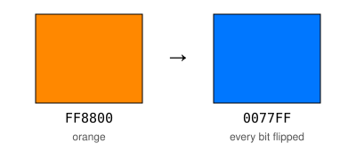

# Bits that flip: XOR and parity

A weather buoy off the west coast of Ireland sends the sea temperature to
land by radio, as a row of bits. A *bit* is a single 0 or 1. Radio is
noisy, and now and then one bit arrives flipped: the buoy sent a 0, and
land received a 1.

The computer on land has never seen the message before. It does not know
what the buoy meant to say. So how could it notice that one bit changed?
Think about it for a moment before you continue. By the end of this page,
you will have a program that notices, with the help of one extra bit.

This page is an extra: the module's outcomes do not need it. It uses
loops from [Loops](lesson:repeating-yourself), and the `byte` type from
[Types and their sizes](lesson:types-and-their-sizes).

The tool for noticing is the operator `^`. On [Powers](lesson:powers-in-csharp),
`2 ^ 3` printed 1, not 8, because `^` is not a power in C#. It does a job
from logic, and it does it one bit at a time. Here it is on single bits.
What do you think the last line prints?

```csharp exec
id: bits-single-1
Console.WriteLine(0 ^ 0);
Console.WriteLine(0 ^ 1);
Console.WriteLine(1 ^ 0);
Console.WriteLine(1 ^ 1);
```

```predict
type: choice

What will the last line print?

- 0
  - `^` gives 1 only when the two bits are different.
- 1
  - Both bits are 1, so the answer is 1, as with "and".
- 2
  - `1 + 1` is 2. Does `^` add?
```

The last line prints 0. The two lines in the middle print 1, where the two
bits are different. The first and the last print 0, where the two bits are
the same.

This operator is called *exclusive or*, or *XOR* for short. XOR of two
bits is 1 when exactly one of them is 1. In everyday English, "or" often
means this: "tea or coffee?" offers one of them, not both. The `||` from
[Decisions](lesson:making-decisions) is the other kind of "or": it is
`true` when at least one side is `true`, and that includes both. Maths
writes XOR as $\oplus$, so the last line says $1 \oplus 1 = 0$.

Think of a light on the stairs, with one switch at the bottom and one at the
top. Pressing either switch changes the light. Write a switch that is up
as 1, and a switch that is down as 0. Then the light is on when exactly
one switch is up, and off when both are up or both are down. The light is
`bottom ^ top`.

`^` works on `true` and `false` as well. What do you think this cell
prints?

```csharp exec
id: bits-single-2
bool bottomUp = true;
bool topUp = false;
Console.WriteLine(bottomUp ^ topUp);
Console.WriteLine(bottomUp != topUp);
Console.WriteLine(true ^ true);
Console.WriteLine(true != true);
```

It prints `True` twice, then `False` twice. For two `bool` values, `^` and
`!=` ask the same question: are these two different? Can you change
`bottomUp` and `topUp`, and try all four ways to set the two switches? Do
the first two lines agree every time?

So why does C# have both? `!=` asks whether two values are different. `^`
also works on each bit of a number, one bit at a time, and the rest of this
page uses that.

### Your turn

In some tall buildings, the light on the stairs has three switches, one on
each floor. The three loops in this cell, one inside another, give every
way to set three switches: eight rows. Can you change the `0` so that
`light` is the XOR of `a`, `b` and `c`? Then look at the rows where the
light is 1. How many of the three switches are up in each of those rows?

```csharp exec
id: bits-your-three-switches
// Every way to set three switches, and the light for each
for (int a = 0; a <= 1; a++)
{
    for (int b = 0; b <= 1; b++)
    {
        for (int c = 0; c <= 1; c++)
        {
            int light = 0;    // change this 0 to the XOR of a, b and c
            Console.WriteLine($"{a} {b} {c}: light {light}");
        }
    }
}
```

```hint
after: 2 runs
Two switches gave `a ^ b`. How could a third switch join that?
```

```solution
for (int a = 0; a <= 1; a++)
{
    for (int b = 0; b <= 1; b++)
    {
        for (int c = 0; c <= 1; c++)
        {
            int light = a ^ b ^ c;
            Console.WriteLine($"{a} {b} {c}: light {light}");
        }
    }
}
---
The light is 1 in four rows: `0 0 1`, `0 1 0`, `1 0 0` and `1 1 1`. Each
of them has one switch up, or three: an odd number. In the other four
rows, an even number of switches is up (none, or two), and the light is 0.
Remember this: the page uses it again at the end.
```

## A switch that flips

Look again at the four lines of the first cell. What does XOR with 1 do
to a bit? And XOR with 0?

- `0 ^ 1` is 1, and `1 ^ 1` is 0. XOR with 1 *flips* the bit: it changes
  0 to 1, and 1 to 0.
- `0 ^ 0` is 0, and `1 ^ 0` is 1. XOR with 0 leaves the bit as it was.

That makes `^ 1` a *toggle*: an action that switches between two states
each time you do it, like the shuffle button on a music player. Press it
once, and shuffle is on. Press it again, and it is off.

This cell starts with shuffle off, and presses the button three times. Is
shuffle on or off at the end? Run it and see.

```csharp exec
id: bits-toggle-1
int shuffle = 0;    // 0 is off, 1 is on
shuffle = shuffle ^ 1;
Console.WriteLine(shuffle);
shuffle = shuffle ^ 1;
Console.WriteLine(shuffle);
shuffle = shuffle ^ 1;
Console.WriteLine(shuffle);
```

It prints 1, 0 and 1. After an odd number of presses, shuffle is on.
After an even number, it is off again, as it was at the start.
`shuffle ^= 1;` is a shorter way to write the same line, as `total += 5;` was on
[Loops](lesson:repeating-yourself).

There is a second fact here. XOR with the same bit twice leaves a bit as
it was, whatever the bit is. Here $b$ stands for any bit, and $k$ for the
bit we XOR it with:

$$b \oplus k \oplus k = b$$

In words: XOR with $k$ undoes itself. Flip, then flip again, and the bit
is the same as at the start. Later sections of this page use this fact.

## XOR on whole numbers

A whole number is kept in memory as a row of bits, as
[Types and their sizes](lesson:types-and-their-sizes) showed. So what does
`12 ^ 10` mean?

A number written as bits is in *binary*, or *base 2*. Binary has only
two digits, 0 and 1. In the numbers we use every day, each place is worth
10 times the place on its right. In binary, each place is worth 2 times
the place on its right: from the right, 1, 2, 4, 8, and so on. 12 is
8 + 4, so in binary it is `1100`. 10 is 8 + 2, so it is `1010`.

Think of the two numbers written one above the other, in columns. C# does
XOR on each column of bits, on its own.

`Convert.ToString(12, 2)` writes 12 in base 2, as text. `.PadLeft(4, '0')`
adds zeros on the left of the text until it is four characters long, so
that the columns are in line.

| | 8 | 4 | 2 | 1 |
|---|---|---|---|---|
| 12 | 1 | 1 | 0 | 0 |
| 10 | 1 | 0 | 1 | 0 |
| `12 ^ 10` | ? | ? | ? | ? |

Can you complete the last row by hand, one column at a time, and find
the number it makes? Then run the cell to compare.

```csharp exec
id: bits-whole-1
Console.WriteLine(Convert.ToString(12, 2).PadLeft(4, '0'));
Console.WriteLine(Convert.ToString(10, 2).PadLeft(4, '0'));
Console.WriteLine(Convert.ToString(12 ^ 10, 2).PadLeft(4, '0'));
Console.WriteLine(12 ^ 10);
```

The third line is `0110`, which is 6, as the last line shows. The column
worth 8 has two 1s, so it gives 0. The columns worth 4 and 2 have one 1
each, so they give 1. The column worth 1 has no 1s, so it gives 0. An
operation that works on each column of bits separately, like this one, is
called *bitwise*.

Here is a useful way to read it. Think of 10 as a list of instructions,
one for each column: 1 means "flip this bit", and 0 means "leave it". A
number used like this is called a *mask*. So `12 ^ 10` means "flip the
bits of 12 in the columns worth 8 and 2".

Now `2 ^ 3`, from Powers, makes sense too. Can you change every 12 in
the cell to 2, and every 10 to 3? In binary they are `0010` and `0011`.
Only the column worth 1 is different, so the answer is `0001`, which is 1.

### Flipping a colour

A screen makes each colour from three lights: red, green and blue. Each
light has a brightness from 0 to 255, which is one byte. A colour is often
written as six *hex* digits, such as `FF8800` for orange. Hex, short for
*hexadecimal*, is base 16. It has sixteen digits: 0 to 9, and then A to F
for 10 to 15. Two hex digits make one byte, from `00` to `FF`, which is 0
to 255. So `FF8800` is red `FF`, the brightest; green `88`, about half;
and blue `00`, none. In C#, `0x` in front of a number says that its digits
are hex.

What happens if we flip every bit of the orange? The mask for that has a 1
in every column: `0xFFFFFF`. Each `F` is 15, which is `1111` in binary,
so every bit of the mask is 1. Each light that was bright goes dark, and
each dark one goes bright. `.ToString("X6")` writes
a number in hex, with capital letters and at least six digits. What colour
do you expect? Run it and see.

```csharp exec
id: bits-colour-1
int orange = 0xFF8800;
int flipped = orange ^ 0xFFFFFF;
Console.WriteLine(orange.ToString("X6"));
Console.WriteLine(flipped.ToString("X6"));
```

It prints `FF8800`, then `0077FF`, a bright blue. Red went from `FF` to
`00`, green from `88` to `77`, and blue from `00` to `FF`. Each light's
brightness became 255 minus what it was. Painters call two colours like
these *complementary*, because they sit opposite each other on the colour
wheel.



### Your turn

1. In the cell below, can you flip `flipped` again, with the same mask,
   and print the result? Which colour is it?
2. Choose a colour of your own, and flip it. What do you expect, before
   you run it?
3. Try the mask `0xFF0000` on the orange. Which light does it flip, and
   which lights does it leave as they were?

```csharp exec
id: bits-your-colour
// Flip flipped again. Then try a colour of your own, and the mask 0xFF0000.
int orange = 0xFF8800;
int flipped = orange ^ 0xFFFFFF;
Console.WriteLine(flipped.ToString("X6"));
```

```hint
after: 2 runs
The mask is the same number both times. What does XOR with the same
number twice do?
```

```solution
int orange = 0xFF8800;
int flipped = orange ^ 0xFFFFFF;
int back = flipped ^ 0xFFFFFF;
int onlyRed = orange ^ 0xFF0000;
Console.WriteLine(flipped.ToString("X6"));
Console.WriteLine(back.ToString("X6"));
Console.WriteLine(onlyRed.ToString("X6"));
---
`back` is `FF8800`, the orange again: XOR with the same mask twice undoes
itself. The mask `0xFF0000` has 1s only in the red byte, so it flips only
red, from `FF` to `00`. Green and blue stay as they were, and the orange
becomes `008800`, a green.
```

## Hiding a message

XOR with the same number twice gives the number you started with. So
XOR can hide a message, and the same XOR shows it again. A *key* is the
number that both people know, and nobody else does.

Each `char` is kept as a number, as `letter - 'A'` showed on
[Variables and types](lesson:storing-and-computing). So `letter ^ key` is
a number too, and `(char)` makes it a character again. The first loop
hides each letter of the message. The second loop does exactly the same
to the hidden text.

```csharp exec
id: bits-hiding-a-message-1
string message = "MEET AT NOON";
int key = 7;
string hidden = "";
foreach (char letter in message)
{
    hidden += (char)(letter ^ key);
}
string shown = "";
foreach (char letter in hidden)
{
    shown += (char)(letter ^ key);
}
Console.WriteLine(hidden);
Console.WriteLine(shown);
```

```predict
type: choice

What will the second line print?

- MEET AT NOON
  - Each letter has been through XOR with 7 twice.
- The hidden text again, the same as the first line
  - The second loop does the same thing as the first. Does it hide the
    message a second time?
- A new text, hidden twice
  - Each loop changes every letter. Could two changes give the first
    letter again?
```

The first line is the hidden message, `JBBS'FS'IHHI`. The second line is
`MEET AT NOON` again. The same loop, with the same key, both hides and
shows. Can you try another key, such as 3 or 20? Some keys give
characters that the console cannot show well.

This lock is weak. Somebody who tries every key, 1, 2, 3 and so on, finds
this one very soon. In 1917 an engineer, Gilbert Vernam, built a machine
that locked messages with XOR, with a key that was as long as the message.
It worked with the teleprinter, a machine that sent typed messages by
wire. It was shown later that if the key is random, as long as the
message, and used only once, nobody can read the message without the key. This is called a *one-time pad*.

## Four more operators on bits

`^` is not the only operator that works on the bits of a whole number.
Here are four more. `&` and `|` look like `&&` and `||` from Decisions,
and they do the same job, but on each column of bits:

- `&` gives 1 in a column where both bits are 1: "and", one bit at a time.
- `|` gives 1 in a column where at least one bit is 1: "or", one bit at a
  time.
- `<<` moves every bit to the left, and fills the new places with 0s. The
  number on its right says how many places.
- `>>` moves every bit to the right. The bits that move past the column
  worth 1 are lost.

Which line do you think prints 8?

```csharp exec
id: bits-more-operators-1
Console.WriteLine(Convert.ToString(12 & 10, 2).PadLeft(4, '0'));
Console.WriteLine(Convert.ToString(12 | 10, 2).PadLeft(4, '0'));
Console.WriteLine(Convert.ToString(12 ^ 10, 2).PadLeft(4, '0'));
Console.WriteLine(1 << 3);
Console.WriteLine(12 >> 2);
Console.WriteLine(13 & 1);
```

| Operator | Name | Each column gives 1 when… | `12` and `10` |
|---|---|---|---|
| `&` | and | both bits are 1 | `1000` |
| `\|` | or | at least one bit is 1 | `1110` |
| `^` | exclusive or, XOR | exactly one bit is 1 | `0110` |

The fourth line prints 8. `1 << 3` moves a single 1 three places to the
left, into the column worth 8. So `1 << n` is 2 to the power of `n`, as an
`int`, and it is a mask with one 1 in it. `12 >> 2` moves `1100` two
places to the right. It becomes `11`, which is 3: the same as `12 / 4`,
with any remainder dropped. And `13 & 1` keeps only the column worth 1,
which is 1 for an odd number and 0 for an even one. So `& 1` is another
way to ask whether a number is odd.

When you use `&` in a comparison, put brackets around it, as in
`(number & 1) == 0`. Without the brackets, C# does `==` first, and the
line does not compile.

## Counting the 1s: parity

Back to the weather buoy. It sends a reading of 14 degrees as one byte,
eight bits. Before it sends the byte, it counts the 1s.

The *parity* of a row of bits says whether it has an even or an odd number
of 1s. A *parity bit* is one extra bit, sent with the message. It is
chosen so that the total number of 1s, in the message and the parity bit
together, is even.

Let's find the parity bit for 14 by hand. In eight bits, 14 is `00001110`.
It has three 1s, which is odd. So the parity bit is 1, to make four.

Now remember the three switches. `a ^ b ^ c` was 1 exactly when an odd
number of the switches were 1. That works for any number of bits: XOR
them all together, and you get 1 when the count of 1s is odd, and 0 when
it is even. That is the parity bit. What do you think this line gives?

```csharp exec
id: bits-parity-1
Console.WriteLine(0 ^ 0 ^ 0 ^ 0 ^ 1 ^ 1 ^ 1 ^ 0);
```

It gives 1, the parity bit for 14. Typing every bit is slow, so a loop can
do it. This cell takes the bits as text, the way `Convert.ToString`
writes them, and XORs them together one at a time.

`bit - '0'` gives the number 1 for the character `'1'`, and 0 for `'0'`,
the way `letter - 'A'` gave a letter's place in the alphabet. The cell has
one gap. The line inside the loop uses `0` where each bit should go. Can
you change that `0`, so that the line uses the bit that the loop has
reached?

```csharp exec
id: bits-toolkit
string bits = "00001110";    // 14, as eight bits
int parity = 0;
foreach (char bit in bits)
{
    parity = parity ^ 0;    // change this 0, so that the line uses each bit
}
Console.WriteLine($"{bits}: parity bit {parity}");
```

```inputs
parity
```

```hint
after: 2 runs
What does `parity` start as? What does XOR with 0 do to it, each time
the loop runs?
```

```hint
after: 3 runs
title: some steps
1. The loop puts each character of `bits` in `bit` in turn: `'0'`, then
   `'0'`, and so on.
2. `bit - '0'` gives the number 0 or 1 for that character.
3. The line should XOR `parity` with that number, in place of the `0`.
```

```solution
string bits = "00001110";    // 14, as eight bits
int parity = 0;
foreach (char bit in bits)
{
    parity = parity ^ (bit - '0');
}
Console.WriteLine($"{bits}: parity bit {parity}");
---
It prints `00001110: parity bit 1`. Why does `parity` start at 0? A row
with no 1s at all has an even count, and its parity bit is 0. Can you
try `bits` as `"1011"` and `"1001"`, and say what you expect before each
run?
```

## Catching a flipped bit

Now let's send the reading. The buoy sends the byte for 14 and its parity
bit, 1. On the way, the radio noise flips one bit. We can make the noise
ourselves, with a mask. In C#, `0b` in front of a number says that its
digits are binary, so `0b00000100` is a mask with a single 1, in the
column worth 4. XOR with it flips that bit.

The reading is a `byte` here, because it is one byte. As
[Types and their sizes](lesson:types-and-their-sizes) found for `+`, C#
converts each `byte` to an `int` before it uses `^`. So `sent ^ noise` is
an `int`, and `(byte)` converts it to a `byte` again. Nothing is lost:
XOR of two numbers from 0 to 255 is always from 0 to 255 too.

The computer on land does not know what was sent. It has only what
arrived. So it finds the parity of the byte that arrived, and compares it
with the parity bit that arrived. If they differ, something flipped. (The
loop does not need eight characters: zeros on the left would not change
the count of 1s.)

What temperature will land receive? Will the check notice? Run it and
see.

```csharp exec
id: bits-catch-1
byte sent = 14;
int parityBit = 1;              // sent with the byte, and it arrives safely
byte noise = 0b00000100;        // one bit flips on the way
byte received = (byte)(sent ^ noise);

int parity = 0;
foreach (char bit in Convert.ToString(received, 2))
{
    parity = parity ^ (bit - '0');
}
Console.WriteLine($"Received: {received} degrees");
Console.WriteLine($"Passes the check? {parity == parityBit}");
```

The buoy sent 14 degrees, and land received 10. Without the parity bit,
nobody would know. With it, land sees that the count of 1s has changed
from odd to even, so the message does not pass the check: the last line
says `False`. Land can then ask the buoy to send it again. With one extra
bit, a computer can notice a mistake in a message it has never seen.

Here is why it works. If any one bit flips, the number of 1s changes by
exactly one, up or down. So an even count becomes odd, and an odd count
becomes even. The parity always changes, and the check always sees it.

Now let's test the limit. What if two bits flip? This cell has noise
that flips the bits worth 4 and 2. Before you run it, think about the
count of 1s.

```csharp exec
id: bits-catch-2
byte sent = 14;
int parityBit = 1;              // sent with the byte, and it arrives safely
byte noise = 0b00000110;        // two bits flip on the way
byte received = (byte)(sent ^ noise);

int parity = 0;
foreach (char bit in Convert.ToString(received, 2))
{
    parity = parity ^ (bit - '0');
}
Console.WriteLine($"Received: {received} degrees");
Console.WriteLine($"Passes the check? {parity == parityBit}");
```

```predict
type: choice

What will the last line print?

- Passes the check? False
  - Two bits flipped, so the count of 1s changed.
- Passes the check? True
  - The count of 1s changed twice. Where did it end?
```

Land receives 8 degrees, and it passes the check: the last line is
`Passes the check? True`. Two flips change the count of 1s twice. It goes
from odd to even, and back to odd. So a parity bit promises to catch any
one flipped bit, and it promises nothing about two.


That is still a useful promise. When flips are rare, two in one short
message are much rarer than one. So parity bits have been used in
computer memory, and on the cables that carried data between early
computers. The check letter at the end of an Irish PPS number uses a
similar idea, with a different calculation: it is one extra character,
calculated from the others, that catches a mistyped digit.

In 1947, Richard Hamming worked at Bell Labs, a research laboratory in the
United States. One Friday, he gave the laboratory's computer a long job to
run over the weekend. The machine found an error early, and stopped, so on
Monday he had no results. He asked himself: if the machine can find that
there is an error, why can it not find where it is, and flip that bit
again? His answer used several parity bits, each one checking a different
group of bits. It was published in 1950, and codes like it still protect
the memory in many large computers today.

### Your turn

1. In the cell below, can you set `noise` to a mask that flips one bit of
   your choice? `1 << 5` is one way to write a mask with a single 1 in it.
   Is the flip caught?
2. Now flip three bits. Is it caught? What about four?
3. What if the parity bit is the bit that flips? Keep `noise` as
   `0b00000000`, so the byte arrives safely, and set `parityBit` to 0.
   What does the check say?
4. Can you write one sentence, as a comment: which numbers of flipped bits
   does a parity bit catch?

```csharp exec
id: bits-your-noise
byte sent = 14;
int parityBit = 1;
byte noise = 0b00000000;        // your noise
byte received = (byte)(sent ^ noise);

int parity = 0;
foreach (char bit in Convert.ToString(received, 2))
{
    parity = parity ^ (bit - '0');
}
Console.WriteLine($"Received: {received} degrees");
Console.WriteLine($"Passes the check? {parity == parityBit}");
```

```hint
after: 2 runs
How many 1s does the mask need, to flip three bits? How many 1s did the
byte have before the flips, and how many after?
```

```hint
after: 3 runs
title: a mask to start from
`0b00000111` has three 1s, so it flips three bits. For four, add one
more 1.
```

```solution
title: three bits flip
byte sent = 14;
int parityBit = 1;
byte noise = 0b00000111;        // three bits flip
byte received = (byte)(sent ^ noise);

int parity = 0;
foreach (char bit in Convert.ToString(received, 2))
{
    parity = parity ^ (bit - '0');
}
Console.WriteLine($"Received: {received} degrees");
Console.WriteLine($"Passes the check? {parity == parityBit}");
---
It prints `Received: 9 degrees` and `Passes the check? False`, so three
flips are caught. Three flips change the count of 1s three times: odd, even,
odd, even.
```

```solution
title: four bits flip
byte sent = 14;
int parityBit = 1;
byte noise = 0b00001111;        // four bits flip
byte received = (byte)(sent ^ noise);

int parity = 0;
foreach (char bit in Convert.ToString(received, 2))
{
    parity = parity ^ (bit - '0');
}
Console.WriteLine($"Received: {received} degrees");
Console.WriteLine($"Passes the check? {parity == parityBit}");
---
It prints `Received: 1 degrees` and `Passes the check? True`, so four
flips are not caught. A parity bit catches any odd number of flips, and misses
any even number.
```

```solution
title: the parity bit flips
byte sent = 14;
int parityBit = 0;              // the parity bit flipped on the way
byte noise = 0b00000000;        // the byte arrives safely
byte received = (byte)(sent ^ noise);

int parity = 0;
foreach (char bit in Convert.ToString(received, 2))
{
    parity = parity ^ (bit - '0');
}
Console.WriteLine($"Received: {received} degrees");
Console.WriteLine($"Passes the check? {parity == parityBit}");
---
It prints `Received: 14 degrees` and `Passes the check? False`. The
reading is fine, but the check cannot know that. It sees only that the
count of 1s, in the byte and the parity bit together, is odd. So land asks
for the message again, which costs a little time and loses nothing.
```

## Looking back

<details class="dl-why"><summary>Why this way?</summary>

This page did not stop when the parity bit worked. It continued, flipped
two bits, and showed a changed reading that passed the check. The
page could have ended on the success, with one flipped bit caught. That
page would be shorter, and you would leave with a tool that works.

We showed the failure because a promise holds only when its conditions
hold. The parity bit promises to catch one flip, and it says nothing about
two. The condition, "at most one bit flips", is easy to forget, because
people rarely say it. Knowing where a tool stops is part of knowing the
tool.

</details>

XOR with the same number twice gives the number you started with.
Where on this page did that fact do the work? And where did the page use
XOR to count, not to undo?

A challenge: a phone's PIN is 2468. Somebody hides it with XOR and the key
1357, and then hides the result again with a second key, 4000. Is a PIN
hidden with two keys safer than a PIN hidden with one? Can you find one
key that hides 2468 in exactly the same way as the two keys together?

```csharp challenge
// A PIN hidden twice, with two keys.
// Is it safer than a PIN hidden once?
int pin = 2468;
int once = pin ^ 1357;
int twice = once ^ 4000;
Console.WriteLine(once);
Console.WriteLine(twice);
```

This is an extra page, so it has no practice page. If you would like more
on binary and hex, [Programming languages](lesson:how-we-got-here) writes
numbers both ways, and shows how text is kept as numbers.

Everything on this page runs here, in the browser, and none of it needs
Visual Studio.

## Where to read more

Microsoft. *Bitwise and shift operators (C# reference)*.
<https://learn.microsoft.com/en-us/dotnet/csharp/language-reference/operators/bitwise-and-shift-operators>.
The official description of `&`, `|`, `^`, `<<` and `>>`, and of `~`,
which flips every bit of a number and which this page does not use. It is
written for programmers who already know C#.

Spanning Tree (2020). *Hamming Codes: How Data Corrects Itself.*
<https://www.youtube.com/watch?v=NQ4gLJYspdA>. This page catches one
flipped bit with one parity bit. Brian Yu shows how a few more parity bits
can also find which bit flipped, so that it can be flipped again. The video
is about seven minutes long.
