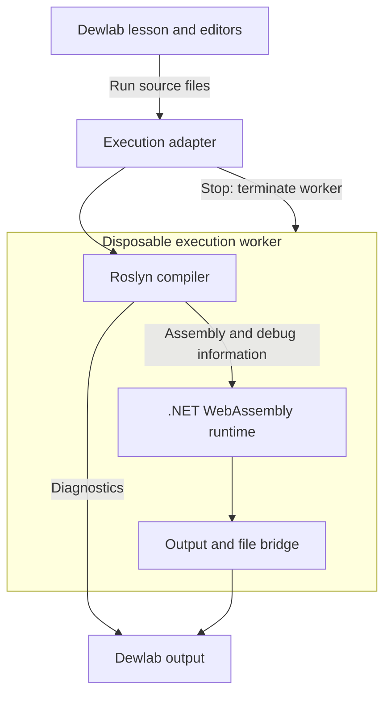

# C# cells in Dewlab: implementation plan

**Status:** proposal for discussion and later implementation. No repository changes have been made.

**Prepared:** 26 September 2026, for Joshua Aaron.

**Repository baseline:** [`deweydex/dewlab`, commit `58b81e44d507142205805fac23e9b14e65a05b17`](https://github.com/deweydex/dewlab/tree/58b81e44d507142205805fac23e9b14e65a05b17). This is a newer snapshot than the one inspected at the start of our discussion. Recheck the named functions and paths before implementing.

All new filenames, schemas, interfaces and Markdown conventions below are **proposed**, not existing features. Existing behaviour is identified separately. Browser feasibility has been researched, but no C# prototype or performance test has been run for this plan.

## 1. Recommended direction

Add a C# execution engine alongside Pyodide. Keep Dewlab's Markdown lessons, CodeMirror editors, hints, predictions, notes, versioned work and static hosting.

Use **ordinary C# program compilation** for the first release. Each C# exercise is a complete program, either one source file or a named group of source files. Each Run starts a fresh execution. A later cell does not inherit live C# variables from an earlier cell.

This is particularly useful for Programming and Design Principles (PDP) and Fundamentals of Object-Oriented Programming (FOOP): learners can use namespaces, explicit entry points, multiple classes, interfaces and multiple files without adopting C# Script's notebook-specific restrictions.

Persistent C# scripting sessions remain a separate possible feature. They are not a prerequisite for useful C# lessons, and should not determine the first implementation.

### Proposed decisions

| Decision | Recommended default | Reason |
|---|---|---|
| Execution location | Learner's browser | Retains Dewlab's no-install teaching model and static hosting |
| Compiler | Microsoft Roslyn | Ordinary C# syntax, diagnostics and compilation |
| Execution runtime | A pinned .NET WebAssembly runtime, initially evaluate .NET 10 | Runs compiled .NET instructions in the browser |
| Editor | Existing CodeMirror 6 integration | Retains accessibility, themes and editing conventions |
| UI framework | Existing JavaScript and HTML | No Blazor rewrite is needed |
| Cell semantics | Complete program; fresh run | Predictable behaviour for class and program-structure teaching |
| Multi-file semantics | Explicit project group | Files share a compilation; unrelated exercises remain independent |
| Input | Pre-supplied text consumed through `Console.ReadLine()` | Standard student code without a live terminal dependency |
| Stop | Terminate the execution worker | Works even when student code does not cooperate |
| Packages | A small pinned catalogue | Avoids promising arbitrary NuGet and desktop compatibility |
| C# export | `.cs` or a `.csproj` project ZIP | Preserves ordinary program semantics outside Dewlab |
| Notebook export | Preserve C# as source; do not promise executable Polyglot parity | Program cells and scripting cells mean different things |
| Runtime integration | Evaluate WasmSharp first; retain the option of a small direct host | Reuse where it fits without coupling Dewlab to one package |

These are implementation defaults to discuss, not decisions already made by the repository.

## 2. What the current repository already provides

The source inspection found useful boundaries, but also Python assumptions that must be handled explicitly.

| Existing file or area | Verified current behaviour | Consequence for C# |
|---|---|---|
| `build.py` | `CELL_TYPES` contains `python` and `sql`; `Cell.type` defaults to Python | Extend the model and parser without changing old defaults |
| `build.py: parse_cell()` | Reads cell headers and expands includes | Add validated C# execution/project fields |
| `build.py: parse_solution()` | Immediately compiles solution text as Python | Defer validation until the target cell's language is known |
| `build.py: render_solution()` | Renders solution code as Python | Make language explicit |
| `build.py: check_solutions()` / `_run_solutions()` | Uses a separate Python process; execution loop selects Python cells | Add an explicit C# validation route; never silently skip advertised C# checks |
| `build.py` page manifest | Omits `type` for ordinary Python cells | Continue reading missing `type` as Python |
| `assets/tutorial-runtime.js` | Contains its own Pyodide worker and main-thread paths | Tutorials do not simply delegate all execution to `pyodide-engine.js` |
| `assets/tutorial-runtime.js: executeCell()` | Calls Python execution and consumes reports for hints/predictions | Add language dispatch while preserving report semantics |
| `assets/pyodide-engine.js` | Page-independent Python interface used by the Notebook | Useful model for a C# engine; not already a universal engine |
| `compose/dewmini.js` | Has Python, text, web, SQL and JavaScript cell types | Add C# to creation, rendering, execution, loading and export paths |
| `compose/js-cell-engine.js` | Separate JavaScript engine; reuses Python-engine output plumbing | Extract small shared output utilities rather than copying them again |
| `compose/dewmini-fs.js` | Delegates filesystem operations to Pyodide | A C#-only file view must not accidentally require Python |
| `vendor-src/codemirror-entry.js` | Language selection plus Python-specific Jedi assistance | Add C# highlighting and separate language-service hooks |
| `assets/editor.js` | `parseCells()` and `restoreExecTag()` recognise Python/SQL execution fences | Authoring round trips need C# support too |
| Tutorial and Notebook exports | Python kernel metadata and Python-specific transformations | Do not label C# source as executable Python |
| `dev/from_notebook.py` | Converts code cells into `python exec` fences | Detect unsupported languages rather than silently mislabelling them |
| Saved tutorial work | Stable page and cell IDs; code and rendered output saved locally | Preserve IDs and add metadata without replacing old records |
| `.github/workflows/tests.yml` | Unit checks, vendor freshness check and selected browser tests; selected browser tests do not run cells | Real C# execution coverage would be a deliberate new CI gate |
| `.github/workflows/deploy.yml` | Builds a static site and publishes it to GitHub Pages | Add a reproducible runtime-asset preparation step |

The current workflow is the authority where older prose documentation differs. In particular, there is already a limited browser CI job; it is not correct to say that all browser tests are local-only.

## 3. Scope and teaching boundaries

### First classroom release

- Standalone C# programs embedded in lessons.
- Multi-file C# exercises with namespaces and one entry point.
- Loops, methods, arrays, lists, dictionaries, recursion and basic LINQ.
- Classes, constructors, access modifiers, inheritance, interfaces, polymorphism and exceptions.
- Standard output, compiler diagnostics and runtime error reporting.
- Supplied input, predictable fresh runs and reliable Stop.
- Saved edits and C# project export.
- Plain hints, predictions and visible reference solutions.

The list describes intended capabilities, not a certification that every PDP/FOOP learning outcome is covered. Validate the eventual pilot lessons against the current module descriptors and the repository's curriculum map.

### Later features

- Method-result comparison and learner-written test harnesses.
- File-data exercises and persistence.
- Structured tables, object snapshots and charts.
- Semantic completion and hover information.
- C# program cells in the general Notebook and a small multi-file project view.
- Browser controls connected to C# methods.

### Separate projects or explicitly deferred

- Persistent C# Script sessions and automatic cross-cell variable sharing.
- Full debugger support: breakpoints, stepping, watches and arbitrary local-variable inspection.
- Running arbitrary `.csproj` build targets, `dotnet` commands or NuGet restore inside the browser.
- Windows Forms, WPF, operating-system processes or unrestricted local filesystem access.
- Transparent Python/C# object sharing or shared live Python/C# SQLite state.
- General server application hosting inside the browser.

## 4. Architecture and ownership

The runtime stack is:

1. **Dewlab UI:** lessons, CodeMirror, controls, saved work and accessible output.
2. **Execution adapter:** selects the engine and assembles the source files for one exercise.
3. **Worker host:** starts .NET, receives a run request and sends typed results back.
4. **Roslyn:** parses C# files, checks them against known references and emits an assembly.
5. **.NET WebAssembly:** executes the assembly's entry point.
6. **Output bridge:** forwards printed text, diagnostics and approved structured results.

Roslyn emits .NET intermediate language (IL). The browser-compatible .NET runtime executes it. Do not plan a full ahead-of-time WebAssembly compilation for every Run. The host must retain the ability to load and execute newly emitted IL.



This is the logical execution diagram. Origin isolation for imported or shared code is a separate deployment concern described in section 13; a worker alone is not a security boundary from its own origin.

### Build time versus learner runtime

| When | What happens |
|---|---|
| Maintainer builds the engine | .NET SDK builds the trusted host; pins compiler/runtime versions; produces browser assets and reference assemblies |
| Dewlab builds lessons | Python parses Markdown, creates manifests and copies validated runtime assets |
| Learner opens a page | Reads content and edits code; no .NET download is needed until a C# action requires it |
| Learner presses Run | Browser loads the engine if necessary; Roslyn compiles current source; .NET executes it locally |
| Learner downloads a project | Dewlab writes source, supported project settings and any selected data files |

## 5. Execution semantics: make the rules explicit

### 5.1 Independent program cells

A single `csharp exec` cell is one program. Its implicit filename is `Program.cs` unless the author specifies another filename. Use `SourceCodeKind.Regular`, not script parsing.

- Run uses the current editor contents.
- Top-level statements are supported, as is an explicit `Main` method.
- No live variables are inherited from another C# exercise.
- Re-running creates new objects and static state.
- A compile error prevents execution; output is labelled as compilation failure rather than a runtime exception.
- The previous result becomes visibly stale when code or inputs change.
- Reloading the page restores source and saved output, not an execution session.

Do not automatically print the last expression by rewriting it into Python-like notebook behaviour. Use `Console.WriteLine` initially and an explicit display helper later.

### 5.2 Named multi-file exercises

Several authored cells can belong to one project group. Each cell owns a distinct logical `.cs` file. Pressing Run on any member compiles all the current files in that group and runs it once.

- A project group is scoped to its page and world variant, not a global repository name.
- Exactly one entry point is required for executable projects.
- Only one source file may contain top-level statements; other files may define ordinary types and namespaces.
- Use Roslyn's normal errors for conflicting declarations and entry points.
- File order must not be repurposed as notebook execution order.
- One shared output panel belongs to the project; it must be reachable from each member's Run control.
- Mark all member files as part of the last run, with a shared source revision.
- Run all/above/below deduplicates projects. A selected member means the whole project runs once.
- Reset on a file restores that file only. A separate project reset restores all members and supplied inputs.

For the first implementation, keep a project's authored file blocks in one contiguous exercise region. Reject ambiguous reuse across separated exercises. A later tabbed view can display that group more compactly without changing its identity.

### 5.3 Fresh state requires a real implementation

Resetting our own dictionary is not enough: student assemblies can retain static fields, event subscriptions, timers and unfinished tasks.

**Conservative baseline:** one disposable execution worker per Run, terminated after final output/file collection, on Stop, or on timeout. Assets can remain in the browser's HTTP cache, but runtime initialisation still costs time.

Measure that cost in the prototype. Only reuse a runtime if a supported isolation/unload design proves that static state and background work do not leak. Do not promise collectible assembly unloading on browser .NET until it has been demonstrated on the chosen release.

A separate persistent compiler/language-service worker is an optional optimisation. It introduces a second runtime and memory cost, so add it only if measurements justify it.

## 6. Proposed Markdown authoring format

### 6.1 A complete program

````markdown
```csharp exec
id: adding-five-numbers
name: A running total
using System;

int total = 0;
for (int number = 1; number <= 5; number++)
{
    total += number;
}
Console.WriteLine(total);
```
````

Use `csharp` as the canonical language token. Support `cs` only if explicitly added as a normalised alias; do not let several spellings drift through storage and exports.

### 6.2 A multi-file FOOP exercise

````markdown
```csharp exec
id: enrolment-main
project: enrolment
file: Program.cs
using System;
using College;

var student = new Student("Ada");
Console.WriteLine(student.Name);
```

```csharp exec
id: enrolment-student
project: enrolment
file: Student.cs
namespace College;

public class Student
{
    public string Name { get; }

    public Student(string name)
    {
        Name = name;
    }
}
```
````

This is a proposed extension to the existing header grammar. No hidden concatenation of unrelated earlier cells occurs.

### 6.3 Supplied input

Introduce a separate block, because existing `inputs` blocks mean expressions to compare, not standard input:

````markdown
```stdin
for: enrolment-main
Ada
21
```
````

The target identifies the program or a member of its project group. Display this as editable input before Run. Preserve blank lines and line order; reset its read cursor for every run. Reject multiple conflicting stdin blocks for the same project.

### 6.4 Parser and validation rules

- Extend `Cell` with optional `execution`, `project` and `file` fields; default C# to `execution: program` internally.
- Retain `type` as the existing language discriminator; do not introduce a competing `language` field in saved cells.
- Parse headers only at the start of the fence, then treat the remaining text as literal source. Protect C# labels and strings from accidental header consumption.
- Validate project/file identifiers, duplicate IDs, duplicate normalised filenames and entry-point diagnostics.
- Allow relative logical paths only; reject absolute paths, `..`, drive prefixes, control characters and portable case-collision hazards.
- Continue expanding explicit include directives, but validate their allowed roots. Class libraries can be supplied as included source files without executing Python toolkit code.
- Treat Markdown headings, predictions and text hints as language-independent.
- Initially reject C# `toolkit`, `expect`, `tests` and expression-comparison `inputs` metadata unless the corresponding C# feature is implemented. An explicit build error is better than a control that silently does nothing.
- Keep existing Python and SQL grammar valid without edits.
- For world variants, group files by visible world selection and never compile hidden variants together. Stop active C# work when switching worlds; invalidate the displayed run identity.

## 7. Proposed manifest and engine contracts

### 7.1 Manifest additions

Keep the present `cells` array. Add explicit project records and engine requirements. For example:

```json
{
  "schemaVersion": 2,
  "requiredEngines": ["csharp"],
  "cells": [
    {
      "id": "enrolment-main",
      "type": "csharp",
      "execution": "program",
      "project": "enrolment",
      "file": "Program.cs",
      "code": "..."
    },
    {
      "id": "enrolment-student",
      "type": "csharp",
      "execution": "program",
      "project": "enrolment",
      "file": "Student.cs",
      "code": "..."
    }
  ],
  "csharpProjects": [
    {
      "id": "enrolment",
      "cellIds": ["enrolment-main", "enrolment-student"],
      "outputCellId": "enrolment-main",
      "stdin": "",
      "referenceSet": "core-v1"
    }
  ]
}
```

The sample omits unrelated existing manifest fields. Missing schema/version/type fields must retain legacy behaviour. Derive required engines from actual runnable features: SQL and existing app-query bridges still require Python even when there is no explicit Python cell.

Reference sets are named curated bundles, not arbitrary package URLs. Pin target framework, C# language version, nullable settings and imports in runtime configuration so browser and export agree. Recommended initial defaults: regular source, explicit `using` directives, no implicit usings, warnings shown but not treated as errors. Do not use a floating `latest` language version.

### 7.2 Small shared interface

Introduce a registry with language capabilities. Wrap existing Python behaviour rather than moving all Pyodide internals in the first change.

```typescript
interface ExecutionEngine {
  initialise(config: EngineConfig): Promise<void>;
  run(request: RunRequest, emit: (event: RunEvent) => void): Promise<RunReport>;
  stop(runId: string): void;
  dispose(): void;
  capabilities: {
    execution: "session" | "program";
    suppliedInput: boolean;
    liveInput: boolean;
    comparison: boolean;
    completion: boolean;
    variableInspection: boolean;
  };
}
```

These TypeScript-like definitions specify the contract; they do not require converting Dewlab to TypeScript. Use JavaScript modules and JSDoc if that best fits the repository.

Python-only operations such as `describeGlobals`, import reload and filesystem mounts remain optional engine-specific capabilities. Do not force C# to fake a Python namespace.

### 7.3 Messages and reports

Every worker request and event carries a protocol version, request/run ID, engine generation and project/cell identity. Diagnostics also carry the source revision. Discard messages from stopped runs and stale editor revisions.

| Message/event | Required content |
|---|---|
| `initialise` | Runtime asset version, compatible reference-set ID and limits |
| `run` | Current source files, supplied stdin, optional file-data snapshot and source revision |
| `status` | Loading, compiling or running |
| `diagnostic` | Severity, compiler code, message, file, span and source revision |
| `stdout` / `stderr` | Bounded text chunk and sequence number |
| `display` | Approved typed payload; introduced later |
| `file-changes` | Validated staged file changes; introduced with file support |
| `complete` | Success/error kind, exit code where applicable and timings |
| `host-error` | Infrastructure failure, kept separate from a student error |

Normalise compiler spans to one documented convention: zero-based UTF-16 offsets for CodeMirror, one-based lines/columns for displayed messages. Test non-ASCII text and CRLF input.

`RunReport` should distinguish `compile-error`, `runtime-error`, `stopped`, `timeout` and `host-error`, with `ok` retained for existing callers. Compilation/runtime errors can feed staged hints; user Stop and unavailable runtime assets should not count as failed learning attempts. Predictions settle only after successful execution. Keep native compiler messages available alongside any short friendly explanation.

## 8. C# runtime host implementation

### 8.1 Evaluate WasmSharp against a concrete checklist

WasmSharp is evidence that Roslyn compilation and execution can happen locally in the browser. It is a candidate integration dependency, not a promise that Dewlab's needed features already exist.

Evaluate a pinned revision for:

- Ordinary multi-file compilation, configurable references and parse options.
- Worker boot, termination and disposal hooks.
- Incremental output rather than output returned only after completion.
- Correct awaiting of asynchronous entry points and capture of their exceptions.
- Standard input redirection.
- Diagnostic file/line mapping and portable debug symbols.
- Runtime packaging under a GitHub Pages project path.
- Licence obligations, reproducible builds and dependency footprint.

The execution source inspected earlier emits an assembly, invokes its entry point and captures output. That does not by itself demonstrate these additional behaviours. Reinspect the chosen revision before adoption.

If adapting it requires substantial replacement of its execution layer, implement a small direct .NET host and reuse ideas or permitted code selectively with attribution.

### 8.2 Direct-host responsibilities

1. Load the trusted host and compiler.
2. Build syntax trees for each file with its real logical filename.
3. Resolve metadata references from a fixed manifest of compiler reference assemblies.
4. Create a regular console-application compilation and collect diagnostics.
5. Stop before execution if compilation contains errors.
6. Emit the assembly and portable PDB to memory.
7. Load the assembly into the selected interpreter-capable runtime.
8. Redirect `Console.Out`, `Console.Error` and `Console.In` using host-controlled readers/writers.
9. Invoke the actual generated/declared entry point, supporting no arguments or `string[]` as appropriate; await task results where required.
10. Capture exceptions and exit status, flush output, collect approved file changes and dispose the worker.

Use matching compile-time references and runtime assemblies. Do not assume an assembly's browser `Location` is a usable filesystem path. Package reference metadata explicitly and test the published, trimmed build, not only Debug.

Host code may require unsafe support for generated JavaScript interop. Student compilation can still default to `allowUnsafe: false`. That is a teaching/configuration choice, not a security sandbox.

### 8.3 Failure and resource handling

- A UI-side watchdog enforces run duration because code running in a tight loop cannot reliably receive a cooperative cancel message.
- Cap source/input sizes and output bytes/events; terminate excessive output before it overwhelms the page.
- Batch output messages while preserving stream order; flush at completion.
- Use separate boot and execution timeouts; slow downloads are not student runtime errors.
- Terminate on timeout and reject outstanding requests once; clear the UI's running state in `finally`.
- Stop and navigation must preserve saved source even when the worker never returns.
- Classify worker crashes separately. Browser-level memory exhaustion cannot be guaranteed recoverable; test sensible limits on classroom devices.
- Handle or disable student `Environment.Exit` so the UI does not remain indefinitely busy.
- Keep a nonzero exit code visible as a program result without confusing it with a compiler diagnostic.

## 9. File-by-file implementation map

### Existing files to change

| File | Changes |
|---|---|
| `build.py` | C# cell/project/input models; parsing and grouping; language-aware solutions; engine requirements; manifest additions; asset copying; export/download decisions |
| `assets/tutorial-runtime.js` | Engine dispatch in boot/run/stop/batches; project assembly; report adaptation; C# diagnostics; capability-aware panels; saving and exports |
| `assets/shell.html` | Language-neutral status/help where needed; C# input/project output controls; appropriate download controls |
| `assets/tutorial-style.css` | Diagnostic list, input panel, project file navigation, loading/error states; use existing theme and accessibility conventions |
| `assets/pyodide-engine.js` | At most extract shared output helpers; keep Python semantics intact |
| `compose/js-cell-engine.js` | Import extracted output helpers if moved |
| `vendor-src/codemirror-entry.js` | C# highlighting; diagnostics extension; generic completion/hover hooks; read-only C# highlighting |
| `vendor-src/package.json` and lockfile | Pin the chosen C# syntax support and any additional CodeMirror diagnostics dependency |
| `vendor-src/build-vendor.mjs` | Include new browser modules correctly; keep heavy .NET assets out of the ordinary editor bundle |
| `assets/vendor/*` | Regenerate affected committed bundles using the existing workflow |
| `assets/editor.js` | Recognise C# fences, metadata, project grouping and IDs; preserve `exec` through Crepe round trips; mirror structural validation |
| `vendor-src/milkdown-entry.js` | Audit language picker and code-fence round trips; add C# support only where needed |
| `compose/dewmini.js` | C# cell type, creation/duplicate/load/render/run/stop, status and inspector behaviour, file opening, saving and exports |
| `compose/notebook.html` and `compose/dewmini-style.css` | Notebook C# creation controls, project/file UI and help |
| `compose/dewmini-fs.js` | Preserve Python filesystem; introduce a deliberate interface for later C# data support rather than mounting it through Pyodide |
| `dev/from_notebook.py` | Kernel/language detection; reject or preserve unsupported semantics; never turn C# code into a Python fence |
| `check.py` | C# ID/project/metadata checks and explicit reporting of which validation stages ran |
| `.github/workflows/tests.yml` | Runtime build/cache and minimal real C# browser execution gates, plus parser/storage regression coverage |
| `.github/workflows/deploy.yml` | Prepare verified C# runtime assets before publishing; fail when required assets are absent |
| `README.md`, `ARCHITECTURE.md`, contributor/student/author docs | Describe new semantics, setup, boundaries and export behaviour accurately |

Some paths are audit targets rather than guaranteed edits; avoid changing a file simply because it appears in this table.

### Proposed new files or directories

| Proposed path | Responsibility |
|---|---|
| `assets/execution-engines.js` | Engine registry and capability lookup |
| `assets/csharp-engine.js` | UI-side worker lifecycle, requests and normalised reports |
| `assets/csharp-worker.js` | Worker-side bootstrap and .NET calls |
| `assets/execution-output.js` | Small shared text/output utilities; no runtime boot side effects |
| `assets/csharp-projects.js` | Resolve groups, build source snapshots, deduplicate run units and generate exports |
| `assets/csharp-diagnostics.js` | File mapping, editor marks and accessible diagnostic navigation |
| `runtimes/csharp/Dewlab.CSharp.Host/` | Trusted .NET compiler/execution host and interop code |
| `runtimes/csharp/Dewlab.CSharp.Core/` | Pure compilation/configuration logic reusable by host tests and optional build-time validation |
| `runtimes/csharp/Dewlab.CSharp.Tests/` | Host compilation and protocol tests |
| `runtimes/csharp/global.json` | Pin SDK policy for the runtime subproject |
| `runtimes/csharp/runtime-lock.json` | Runtime/compiler/reference versions, asset digest and build provenance |
| `dev/build_csharp_runtime.py` | Reproducibly build/publish runtime assets |
| `dev/fetch_csharp_runtime.py` | Fetch and verify a prebuilt pinned runtime for authors without the SDK, if this distribution route is chosen |
| `docs/csharp-engine-explained.md` | Runtime architecture and lifecycle |
| `docs/CSHARP.md` | Authoring, supported features and export rules |
| `planning/CSHARP.md` | Accepted decisions and remaining choices once implementation is authorised |

Generated runtime output should live in an ignored build/cache directory and be copied into `site/assets/csharp/<asset-version>/` during publishing. Do not hand-edit `site/` or commit a large runtime into the existing editor bundle.

## 10. Tutorial and Notebook integration details

### Tutorials first

Add dispatch at the existing boot/run/stop boundaries. Do not undertake a full tutorial-runtime rewrite to obtain the first C# cell.

- On a C# run, use only the C# path; do not call Python slider seeding, module reload or globals inspection.
- On Python/SQL runs, retain current worker/main-thread behaviour.
- Mixed-language Run all executes visible run units in document order. C# project units run once. Python cells retain their shared Python state; there is no implicit language bridge.
- Stop ends the active unit and cancels the remaining batch.
- Use engine-specific error/status messages rather than reporting every failure as “Python isn't available.”
- Preserve keyboard Run actions, focus, line numbers, editor settings and existing prediction/hint controls.

### CodeMirror

Evaluate a maintained C# grammar; a legacy C-like C# mode can be an initial highlighting fallback. Choose and pin the actual package during the prototype rather than assuming a first-party `@codemirror/lang-csharp` package exists.

Start with highlighting and diagnostics returned by Run. Semantic completion follows only after ordinary execution works. Roslyn-based completion must see all files in the current project and the same references/options as compilation. Debounce, cancel stale requests, and avoid waking a large compiler on every keystroke before the user needs it.

### General Notebook

Implement after tutorial cells prove the engine:

- Add `CSHARP: "csharp"` to the Notebook's type model and controls.
- Audit `readCells()`, which currently filters against known types. Unknown future cells must be preserved as unsupported data, not silently dropped.
- Extend `ensureSessionForCell`, `canStopCell`, interrupt routing and `executeCell` or their current equivalents.
- Audit every “not JavaScript means Python” branch, including import reload, filesystem initialisation, run batches and status text.
- A first C# Notebook cell remains an independent program. Label its run behaviour clearly.
- Add a separate project document/tab for multiple `.cs` files when ready. Do not make every C# cell in a notebook one implicit project.
- Keep unsupported inspector controls hidden or explanatory. Ordinary program locals cannot be enumerated after completion without instrumentation/debugging.
- Do not change the HTML/CSS/JavaScript Workspace into a C# IDE as part of this work.

## 11. Saved work, imports and exports

### Saved work

Preserve existing tutorial IDs, cell IDs, version keys and `dewmini:*` storage keys. Add schema metadata and per-cell `type`/`execution`/project information; missing fields keep their old meaning.

- Save each logical file by its stable cell/file identity; save stdin once per run unit.
- Treat source revision as the hash of all project files, stdin, selected data and compiler configuration.
- A saved output belongs to that revision; editing any member invalidates it.
- Saved output is a record of a previous run, not proof that variables still exist.
- Preserve unsupported cells on import and round trip, showing them as non-runnable when necessary.
- Duplicate a whole project with new IDs when the user chooses project duplication. Duplicating one member should create a detached draft unless the user explicitly chooses how to resolve filenames.
- Do not replace an existing Python exercise with C# under the same published cell IDs. Add a C# variant/new version with an explicit migration policy.
- Keep existing quota-handling behaviour: preserve source and notes before large outputs.

### Exports

| Export | Proposed behaviour |
|---|---|
| One self-contained C# program | Download a `.cs` source file; offer a project ZIP for easy local execution |
| Multi-file program | ZIP containing source files, a generated minimal `.csproj`, approved data and a short run guide |
| Tutorial saved-work JSON | Preserve language, execution model, grouping and inputs |
| Python-only `.ipynb` | Keep existing behaviour |
| C# or mixed program-cell `.ipynb` | Initially export a reading copy with fenced C# Markdown and preserved Dewlab metadata, explicitly non-executable for C#; or offer the project ZIP instead |
| Single-file tutorial HTML | Reading/saved-output export for C# initially; runnable C# is not promised under `file://` |
| Offline runnable bundle | Separate later bundle served over localhost, with all pinned runtime assets included and tested without network |

Do not fix C# notebook export merely by changing the kernel name. A namespace-containing program is still not equivalent to a C# Script submission.

On notebook import, inspect kernel metadata and language directives. An ordinary C# program may be imported as an independent program after validation. A Polyglot scripting notebook must not be silently relabelled as independent programs; preserve it as source and report the incompatible session semantics. Initially, `dev/from_notebook.py` should fail clearly on unsupported non-Python kernels rather than generate broken lessons.

The generated project must agree with browser compile settings, entry-point behaviour and package references. Any later Dewlab display helpers must ship with a desktop implementation or be clearly documented as browser-specific. Standard `Console`-only lessons should export without a Dewlab runtime dependency.

## 12. Teaching features and solution checking

### Initial support

Reuse prose hints and prediction UI. Reference solutions can be revealed as correctly highlighted C# source. A solution replacing one file in a project must be checked in the context of its sibling files; the first design can require solutions to replace one named file at a time.

Move solution syntax validation out of `parse_solution()` into a stage after cell associations resolve. Python keeps its current validation. C# uses a compiler-validation route with the same reference set and options as the browser.

The first public C# lessons should have a required browser rehearsal of their reference solutions. If an author does not have the C# validation tools, local structural build can report “C# execution validation not run”; CI/publication must not treat that as a completed release gate.

### Later comparisons

Do not run C# comparison expressions inside Python's namespace-copy machinery.

Support two explicitly different comparison types:

1. **Program cases:** same supplied input and file snapshot, compare outputs and exit results from fresh runs.
2. **Method cases:** compile learner source as a library plus a trusted harness that constructs objects and calls named methods.

Run learner and reference versions in separate disposable environments with independent limits. Avoid source-text concatenation that creates duplicate `Main` methods or changes visibility. Define a typed result format for primitives, strings, bounded lists and explicit object summaries; define numeric tolerance per case. Do not infer correctness from arbitrary `ToString()` output.

Respect Dewlab's comparison language: show observations and differences, with room for predictions and reflection, rather than adding scores. Handle intentional exceptions as specified outcomes. Keep compiler failure, learner runtime failure and a broken reference solution distinct.

Formal support for `expect:`, `tests:` and toolkit reuse comes only with documented C# semantics. Until then, authoring validation rejects them on C# cells.

## 13. Input, files, output and execution isolation

### Input

The first `Console.In` reader uses the pre-supplied text. Blank lines are real input; exhaustion returns `null`, as standard end-of-input does. A program repeatedly asking after exhaustion may loop, so the watchdog still applies.

Interactive typing is a later feature. Ordinary synchronous `Console.ReadLine()` cannot simply wait on an asynchronous browser message while blocking the same worker event loop. Evaluate a supported synchronisation design separately, including any SharedArrayBuffer/cross-origin-isolation requirements. Do not silently rewrite student code or require `async` merely to make initial console-menu lessons work.

### Files

Initially, source files are compiler inputs. They are not automatically a persistent student filesystem.

For file-data lessons, prototype the chosen runtime's supported virtual filesystem bridge:

- Import an explicit set of data files into a per-run workspace.
- Demonstrate standard `File.ReadAllText`/`File.WriteAllText` against that workspace.
- Collect file changes before disposal, validate names/sizes and commit only successful runs by default.
- On Stop, discard uncommitted changes and explain that behaviour.
- Keep C# workspace storage separate from existing Python mount internals; introduce shared browser storage only through an intentional adapter.
- Use explicit import/export to share data between languages initially. Do not mount the same writable database into both engines.

If standard filesystem support is not practical in the selected host, defer file-I/O lessons or provide an explicitly named helper. Do not present helper behaviour as ordinary .NET filesystem compatibility.

### Output and object display

Plain console output is always text. Diagnostic content, paths and user data must not enter the page through raw HTML.

Later display helpers send typed data for trusted UI rendering. Bound table sizes and object depth, detect cycles, and avoid arbitrary property getters or `ToString()` execution during automatic inspection. Object snapshots are explicit observations, not a live debugger. Charts can use a JavaScript renderer without changing student-side mathematical code.

### Isolation and untrusted code

The existing authoring editor stores a GitHub token in browser storage. Do not assume that putting C# in a same-origin worker isolates it from that origin's resources. A browser worker is primarily an execution/responsiveness boundary.

Before a public feature that executes imported/shared C#:

- Decide and test an execution-origin boundary, preferably a dedicated static runtime origin with no author credentials or student work storage, embedded behind a narrow message bridge.
- Scope any alternative sandboxed-frame approach to an actual tested configuration; opaque origins, worker creation, module loading and CORS can interact.
- Validate message source/origin and per-frame session identity; pass only the selected source and inputs to the runtime.
- Restrict runtime network access using the deployment's actual CSP/hosting capabilities. A package allowlist is not a network sandbox.
- Treat limited compiler references and disabled unsafe code as compatibility settings, not a security proof.
- Do not execute learner code inside the host build process, or untrusted pull-request code in privileged CI.

Same-origin execution can be used for an isolated local feasibility prototype with trusted examples. The production isolation choice is a release gate, and may require a small separate static hosting location; it does not require a server that runs student code.

## 14. Runtime assets, hosting and development setup

- Pin the SDK/runtime/compiler and reference assemblies as one compatible set. Record licences and provenance.
- Generate a versioned asset manifest and checksums. Copy only a verified matching set into the published site.
- Use relative/module-resolved URLs or a manifest-provided base; test both `/dewlab/` and a custom-domain root.
- Ensure worker scripts, runtime files and reference assemblies load with suitable MIME types and CORS rules for the selected isolation architecture.
- Lazy-load C# assets only when C# is requested. A Python-only or prose-only page must not download them.
- Keep old versioned assets available as needed so cached pages do not refer to removed runtime files during deployment.
- If using a service worker, cache by complete asset version and avoid partially mixing releases.
- Normal Python-only builds should continue to work without a .NET installation. C# previews need either the pinned prebuilt asset bundle or the runtime build tools.
- Public builds with C# lessons fail clearly if their required runtime assets or release-validation records are missing.
- Regenerate committed `assets/vendor/` bundles when their inputs change; retain the existing freshness gate.
- Do not promise offline operation until a full bundle has been tested with the network disabled. HTTP caching alone is not an offline guarantee.

Choose the prebuilt-runtime distribution route after measuring size. A verified release asset fetched by a maintainer script is one option; compiling in deployment CI is another. Avoid adding both paths until the authoring workflow requires them.

## 15. Validation plan and acceptance criteria

Tests must verify learner behaviour and concrete compatibility risks. Unit tests alone cannot establish that dynamic assembly loading works in the published browser runtime.

| Area | Meaningful cases | Pass condition |
|---|---|---|
| Parser | Existing Python/SQL; C# program; duplicate group files; invalid paths; world variants | Old content unchanged; invalid C# structure gives actionable build errors |
| Authoring | Open/edit/save through Crepe; metadata and solution round trips | C# remains runnable and IDs/grouping survive |
| Compiler | Loops, recursion, generics, overloads, namespaces, interfaces, inheritance, multi-file types | Expected output and ordinary C# diagnostics |
| Entry points | Top-level code; explicit `Main`; `async Task Main`; task failure; nonzero exit | Correct completion, output, exception and exit handling |
| Fresh state | Static counters, edited classes, event subscriptions, background tasks; repeated runs | No state/output leaks into the next run |
| Stop | Infinite loop; excessive output; stop during load/compile/run; run again | UI remains usable; no stale output; subsequent run works |
| Input | Blank lines, Unicode, EOF, repeated runs, validation menus | Deterministic standard-input behaviour |
| Diagnostics | Errors in each file; runtime exception; CRLF and non-ASCII text | Correct file and visible line; no misleading host line |
| Saving | Existing records, C# edits, group edits, duplicate, reload, quota failure | Source preserved; outputs carry correct stale/current state |
| Routing | Mixed Python/SQL/C# page; C#-only page; run-all deduplication | Right engines boot; Python/SQL sharing unaffected |
| Export | Single `.cs`, project ZIP, unsupported notebook import | Downloaded project compiles locally; no language mislabelling |
| Isolation | Message spoofing, storage/network boundary, imported markup | Runtime cannot read author credentials; UI renders text safely |
| Deployment | Published Release build under project path; blocked download; old cache | Consistent assets and recoverable infrastructure errors |
| Accessibility | Keyboard file/input/run navigation; focus after error; screen reader output | Controls and diagnostics usable without a mouse |

### Browser and performance checks

Use Chromium and Firefox automation, plus WebKit coverage and a manual check in current Safari on an actual Mac/iPad where relevant. Playwright WebKit is useful but not a complete substitute for Safari/device testing.

Record compressed transfer size, first C# load, warm run latency, memory after repeated runs, and Stop response on a named classroom device/network. Suggested provisional targets for discussion: warm small-program runs within about two seconds and visible Stop recovery within one second. These are acceptance targets, not measured claims. Agree a tolerable first-load budget from the actual school network results.

Prefer one reused browser session for the small execution regression suite where safe, disposing individual runtime workers as required. Keep expensive broad lesson rehearsals local or as a targeted release job. Adding an execution CI gate is a deliberate change to the current selected-browser policy and should be documented.

### Pilot exercise

Build one enrolment or game exercise containing an interface, base/derived classes, validation, a namespace and at least three files. Add supplied menu input and, in the file-support phase, a CSV input. Check that its downloaded project behaves the same way locally.

Do not claim full FOOP/PDP coverage until this and a representative set of lesson requirements have been checked against their learning outcomes.

## 16. Staged implementation and review units

### Phase 0 — Feasibility and decisions

**Work:** outside the production lesson path, evaluate WasmSharp/direct host, multi-file compilation, async entry points, output streaming, Stop, fresh workers, published-build compatibility, deployment isolation and performance.

**Deliverables:** small prototype, measured results, pinned toolchain proposal, explicit decision record and unresolved limitations.

**Exit gate:** real multi-file OOP exercise runs in target browsers; no state leakage; Stop works; viable production isolation and asset route. If a gate fails, revise the design before touching all tutorial layers.

### Phase 1 — One C# program cell in a tutorial

**Work:** parser/model/manifest, C# engine and dispatch, CodeMirror highlighting, compiler/runtime errors, supplied stdin, Stop, saving and a `.cs`/project download.

**Exit gate:** one complete lesson works; Python and SQL fixtures remain unchanged; C#-only runs do not boot Pyodide; authoring round trips preserve the fence.

### Phase 2 — Multi-file FOOP exercises

**Work:** named project groups, file navigation, shared output, diagnostics mapped to files, Run-all deduplication, reset/duplicate rules and project ZIPs.

**Exit gate:** the OOP pilot runs and exports correctly; editing any member invalidates old output; repeated runs start fresh.

### Phase 3 — Teaching support and release hardening

**Work:** language-aware solutions, required reference-solution validation, hint/report integration, source revision tracking, production isolation, failure handling, selected browser CI and documentation.

**Exit gate:** release checklist in section 18 passes. This is the first recommended public classroom pilot, behind an explicit capability flag if useful.

### Phase 4 — Notebook and data work

**Work:** Notebook C# cells and project tabs, robust imports/exports, workspace data bridge, later method comparisons and structured displays.

**Exit gate:** C# work survives open/save/download/reimport and can be used without a hidden Python dependency; supported file behaviour is documented and verified.

### Phase 5 — Optional exploration

Consider semantic completion, numerical/chart libraries, live console input, C# browser controls and persistent scripting. Each has its own feasibility gate. A full debugger is a distinct project.

### Suggested pull-request boundaries for later work

1. Feasibility prototype and decision record.
2. Versioned runtime host, assets and isolated execution plumbing.
3. Build grammar/manifest support and tests, capability disabled in published lessons.
4. Tutorial execution, editor, diagnostics, stdin and saving.
5. Project grouping and exports.
6. Solution/teaching support, docs, pilot lesson and release checks.
7. Notebook support after the tutorial pilot is accepted.

Each review unit should leave existing pages functional. These are future review units only; this plan does not create branches, issues, pull requests or deployments.

## 17. Risks, choices and fallbacks

| Risk or unresolved choice | Proposed response |
|---|---|
| Fresh worker initialisation is too slow | Measure first; explore a persistent compiler plus disposable executor, or a proven reset strategy; never silently retain program state |
| WasmSharp is too limited for our host contract | Use a small direct Roslyn/.NET host behind the same Dewlab adapter |
| Initial download is unsuitable for school devices | Reduce reference catalogue, defer language services, self-host/cache assets; reassess browser scope before scaling content |
| Dynamic execution breaks after publishing/trimming | Pin versions; test actual Release assets; preserve required metadata/IL |
| Runtime line numbers are unreliable | Prove portable-PDB mapping; keep exact compiler diagnostics; do not invent runtime locations |
| Multi-file UI overwhelms beginners | Start with one file; reveal project tabs only when the lesson needs them |
| A classroom requirement depends on desktop APIs | Keep that lesson's browser scope explicit and provide a working local project transition |
| A user expects notebook variable sharing | State fresh-program behaviour in help and lesson structure; do not concatenate prior cells invisibly |
| Old code drops unknown Notebook cell types | Preserve unsupported records before enabling C# Notebook creation |
| Production origin isolation conflicts with existing host setup | Resolve deployment in Phase 0; do not treat a worker as sufficient isolation |

The main discussion choices are whether all first-release C# exercises should be fresh programs (recommended), whether live terminal input is essential at launch, and which FOOP exercise best represents the class's needs. None prevents drafting this implementation plan.

## 18. Definition of done for the first classroom release

- [ ] One PDP lesson and one multi-file FOOP lesson are usable without installation.
- [ ] Regular C# supports namespaces and class/interface examples in the selected runtime.
- [ ] Compile errors identify the correct file and location; runtime errors are distinguishable.
- [ ] Supplied input, fresh execution, Stop and rerun work on target devices.
- [ ] Run all executes each project once and leaves Python/SQL semantics intact.
- [ ] Source, inputs and notes survive reload; stale output is labelled accurately.
- [ ] Authoring round trips retain language, IDs and project metadata.
- [ ] Project exports compile locally with matching settings.
- [ ] No C# source is silently exported/imported as Python or advertised as compatible C# Script.
- [ ] Production execution cannot access the authoring editor's credentials through its origin.
- [ ] Runtime assets are pinned, reproducible and tested from the published path.
- [ ] Public lesson reference solutions pass the required browser rehearsal.
- [ ] Existing unit/bundle checks and relevant browser regressions pass.
- [ ] Actual device performance is recorded and accepted.
- [ ] Documentation and decision records describe what was shipped, including limitations.

## 19. Sources and starting points

### Repository evidence

All links below are pinned to the inspected baseline, so later changes do not alter what this plan was based on.

- [Architecture](https://github.com/deweydex/dewlab/blob/58b81e44d507142205805fac23e9b14e65a05b17/ARCHITECTURE.md)
- [Build and authoring models](https://github.com/deweydex/dewlab/blob/58b81e44d507142205805fac23e9b14e65a05b17/build.py)
- [Tutorial runtime](https://github.com/deweydex/dewlab/blob/58b81e44d507142205805fac23e9b14e65a05b17/assets/tutorial-runtime.js)
- [Python engine](https://github.com/deweydex/dewlab/blob/58b81e44d507142205805fac23e9b14e65a05b17/assets/pyodide-engine.js)
- [Notebook implementation](https://github.com/deweydex/dewlab/blob/58b81e44d507142205805fac23e9b14e65a05b17/compose/dewmini.js)
- [Notebook filesystem](https://github.com/deweydex/dewlab/blob/58b81e44d507142205805fac23e9b14e65a05b17/compose/dewmini-fs.js)
- [CodeMirror integration](https://github.com/deweydex/dewlab/blob/58b81e44d507142205805fac23e9b14e65a05b17/vendor-src/codemirror-entry.js)
- [Authoring editor](https://github.com/deweydex/dewlab/blob/58b81e44d507142205805fac23e9b14e65a05b17/assets/editor.js)
- [Notebook importer](https://github.com/deweydex/dewlab/blob/58b81e44d507142205805fac23e9b14e65a05b17/dev/from_notebook.py)
- [Test workflow](https://github.com/deweydex/dewlab/blob/58b81e44d507142205805fac23e9b14e65a05b17/.github/workflows/tests.yml)
- [Deployment workflow](https://github.com/deweydex/dewlab/blob/58b81e44d507142205805fac23e9b14e65a05b17/.github/workflows/deploy.yml)
- [Contribution and documentation requirements](https://github.com/deweydex/dewlab/blob/58b81e44d507142205805fac23e9b14e65a05b17/CONTRIBUTING.md)

### External technical references

- [Microsoft: use .NET WebAssembly from JavaScript without Blazor](https://learn.microsoft.com/en-us/aspnet/core/client-side/dotnet-interop/wasm-browser-app?view=aspnetcore-10.0) — supports the proposed integration route.
- [Microsoft: WebAssembly build tools and interpreted/AOT execution](https://learn.microsoft.com/en-us/aspnet/core/blazor/webassembly-build-tools-and-aot?view=aspnetcore-10.0) — explains the runtime distinction; exact host build settings still require a prototype.
- [WasmSharp](https://github.com/JakeYallop/WasmSharp) — candidate implementation with local browser compilation, execution and language services.
- [.NET Interactive FAQ](https://github.com/dotnet/interactive/blob/main/docs/FAQ.md) — documents C# Script differences, including namespace restrictions; useful background, not the proposed execution dependency.
- [Microsoft: Roslyn compiler platform](https://learn.microsoft.com/en-us/dotnet/csharp/roslyn-sdk/) — compiler and analysis APIs.
- [Microsoft: top-level statements](https://learn.microsoft.com/en-us/dotnet/csharp/fundamentals/program-structure/top-level-statements) — ordinary C# entry-point simplification and its rules.

External pages describe available technology. The integration decisions, proposed contracts, rollout and acceptance tests in this document are our design proposal, not claims that these features already exist in Dewlab.
